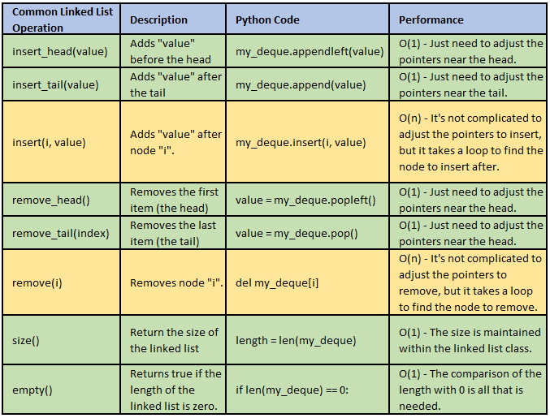

# Linked List

## [Home](README.MD)
* [Stack](Stack.md)
* [Linked List](LinkedList.md)
* [Tree](Tree.md)

A linked list functions similarly to a normal list. However each item, or node, has three things contained in them.
1. its value
2. the location pointer to the previous node
3. the location pointer to the next node

If there is not a previous node, then that is called the "head" If there is not a next node, then that is the "tail".

To help with visualiztion, imagine that a linked list is identical to a chain.

Chains are made up of individual links. Each link can be connected to another link on either side. That is just Linked Lists work as well. See figure below.

### Visual Example

# Inserting and Removing
## At the Head or Tail
When inserting or removing a node in the beginning or end (head or tail) of a linked list, it is simple. The list always know where the head and tail are located. 

Inserting would just involve linking the old head or tail to the new one. 

Removing is just as easy. You just remove the head or tail and the nodes that they were linked to are now the new one.

## In the Middle of the List
When trying to insert or remove from the middle of a list, that's where it will get a more little tricky.

To insert a new node, first you must indicate the value of the node you are going to insert after. Then the insert will loop through the list until it reaches that value. It will now break the link between the two nodes that we are inserting inbetween. Lastly, it will insert the new node and link the previous and next nodes to it.

Removing from the middle will work similarly to inserting. The function will loop through until it reaches the node we want to remove. It will break the links tying it in the list. Then, it will take the nodes that were directly in front and behind the node we just removed and link those two together.

# Common Operations
The chart below contains common linked list operations and their performance speeds.

# Example problem
These are instructions these are instructions these are instructions these are instructions these are instructions these are instructions these are instructions these are instructions these are instructions these are instructions these are instructions these are instructions these are instructions these are instructions these are instructions these are instructions these are instructions these are instructions these are instructions these are instructions

[Problem File](http://url.link.goes.here)

# Solution
[Solution File](http://url.link.goes.here)