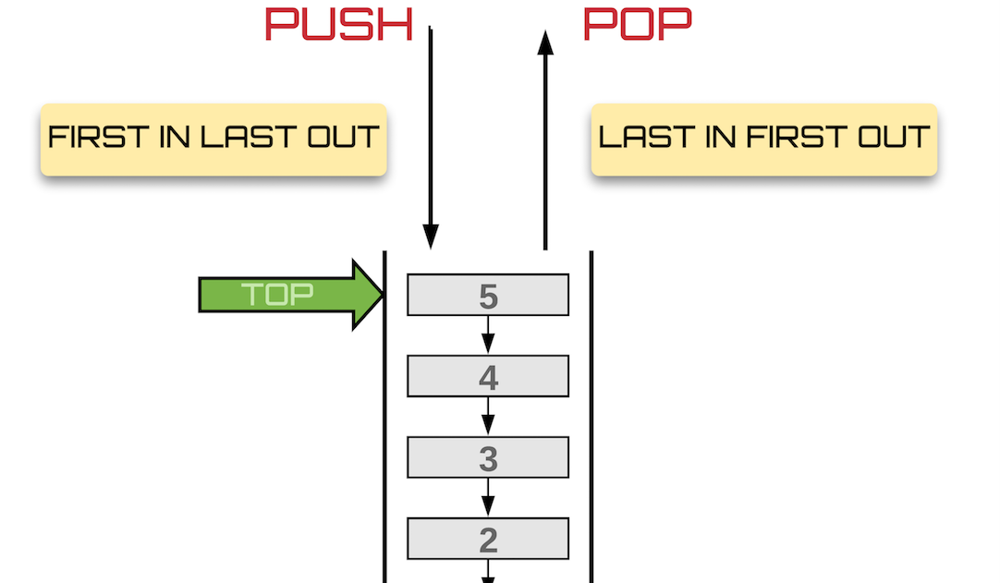
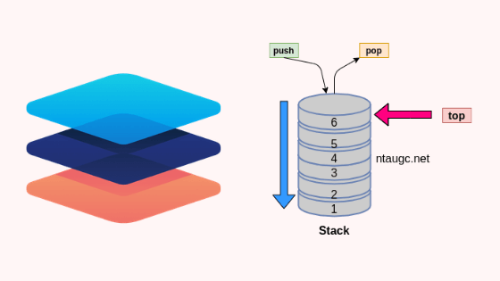

# Stack

## [Home](README.md)
* [Stack](Stack.md)
* [Linked List](LinkedList.md)
* [Tree](Tree.md)

A stack's basic stucture is identical to a dynamic list. The only difference is that a stack is more limitted on how it can add and remove items.

# Push and Pop
When pushing items to a stack, visualize stacking one item on top of the other vertically. To pop an item out, you'll have to remove the most resent item that was pushed (take from the top). That is how a stack functions.

# Common Operations
All actions used in association to a stack have a speed of O(n). Common uses that you'll see is the "undo" button. Your computer saves the recent actions taken and will go back to the most recently performed action.

# Problem
These are instructions these are instructions these are instructions these are instructions these are instructions these are instructions these are instructions these are instructions these are instructions these are instructions these are instructions these are instructions these are instructions these are instructions these are instructions these are instructions these are instructions these are instructions these are instructions these are instructions

[Problem File](http://url.link.goes.here)

# Solution
[Solution File](http://url.link.goes.here)