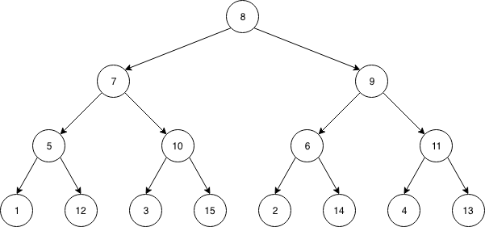
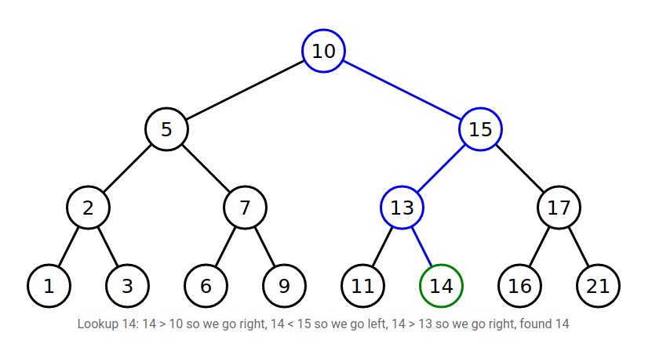
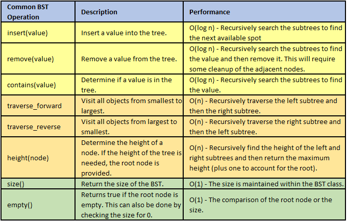

# Tree

## [Home](README.md)
* [Stack](Stack.md)
* [Linked List](LinkedList.md)
* [Tree](Tree.md)

Trees are similar to linked lists. They point to other nodes in the datastructure. However, trees can point to multiple nodes. For now, we're just going to focus on binary trees and binary search trees.

# Binary Tree

Binary trees is a tree that links to no more than two nodes. The node the is at the top is called the root. Nodes that connect to no other nodes are called leaf nodes. A node that has connected nodes is called a parent node. The node connected to the parent are called child nodes. The nodes to the left and right of any parent node form a subtree. See figure below.

# Binary Search Tree

Binary Search Trees (BST) are an efficient alternative to linked lists. They can locate values at much higher rates. Where linked list's speed is at O(n), BST's speed is at O(log n). A BST is able to find values because even unbalances BST are organized. Smaller values being added go to the left of the node and larger values go to the right. Following this pattern is how values can be found. See figure below

See the path that is taken to find the value "14"

# Inserting and Removing Nodes

A similar action is taken when inserting and removing nodes as well. For inserting, it will search down the tree as if it were searching for the value that is going to get added. Once it reaches a leaf, the node will be added as a child to the leaf.

Removing a node will go the same way with searching for the node like before. Once it finds the node, it is then removed. After removal, the tree will clean up and link adjacent branches.

# Common Operations

# Problem
Starting at the Root to one of the Leaves, create a function to find the path with the highest value possible. Then, finish another function to find the lowest sum. Return the lowest and highest sums possible.

[Tree Problem](Problems/TreeEx.py)

# Solution
[Tree Solution](Solutions/TreeSolution.py)